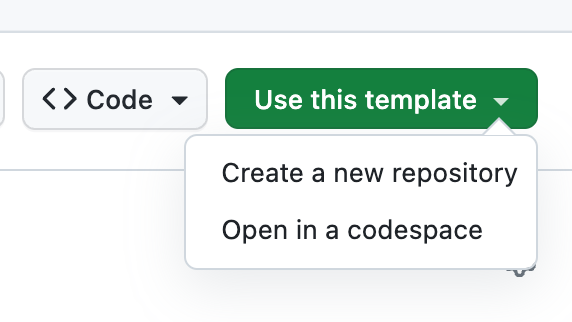
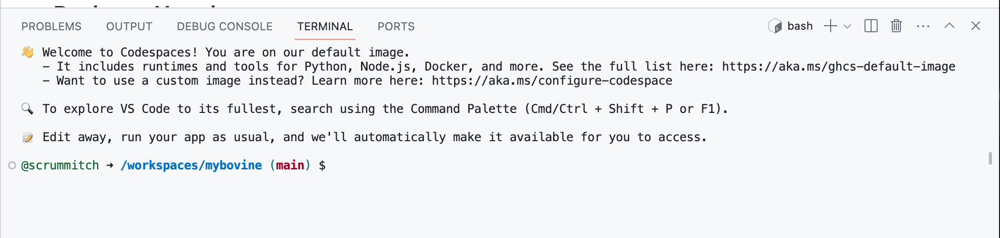
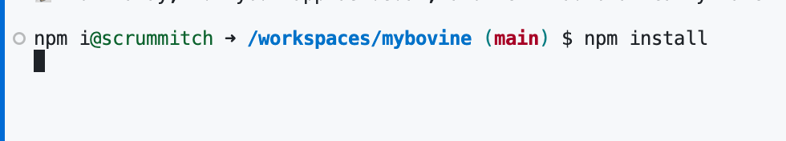
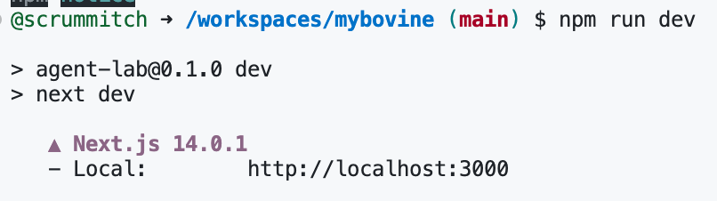
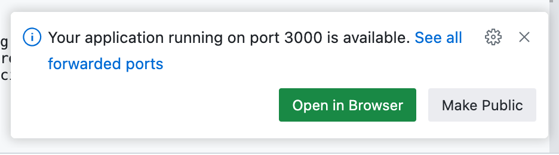

# tANZ TANZ hands on lab

This is a [Next.js](https://nextjs.org/) project bootstrapped with [`create-next-app`](https://github.com/vercel/next.js/tree/canary/packages/create-next-app).

## Getting Started

First, run the development server:

### 1. Create a new codespace from this repository

### 2. The codespace will attempt to install dependencies and start the development server

### 3. Create a new terminal and install dependencies

### 4. Start the development server

### 5. Open The URL provided with your browser to see the result.

### 6. Edit the `.env` and fill in the Api key with the one provided by TANZ

### 7. Re-open the application, it should automaatically reload and you can issue your credential

